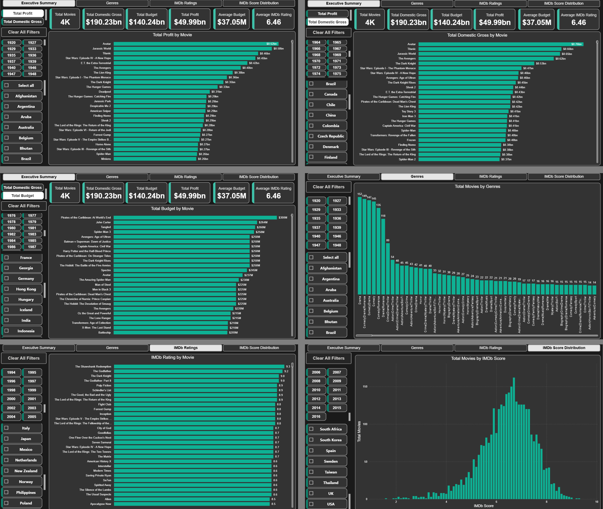
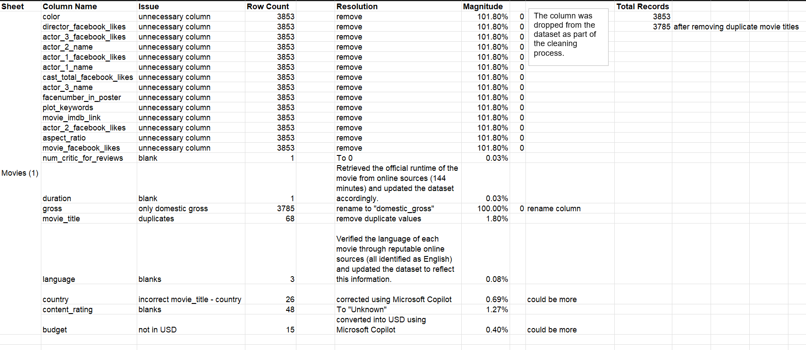
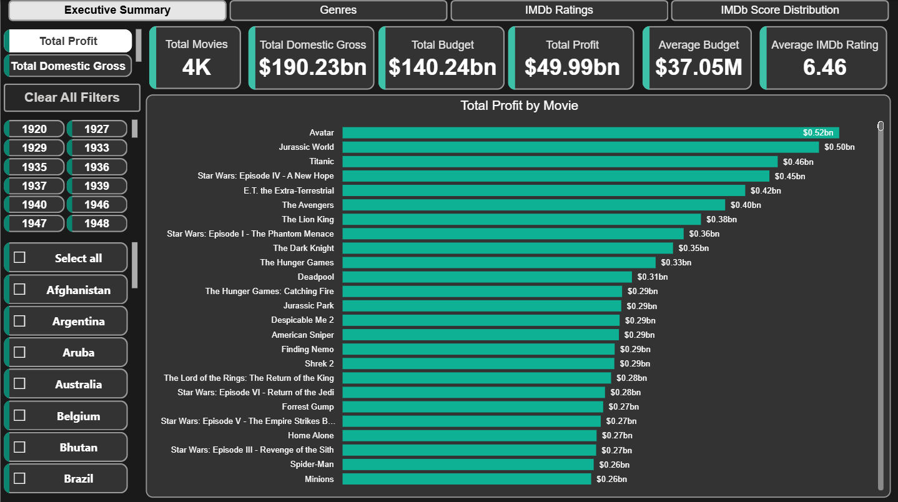
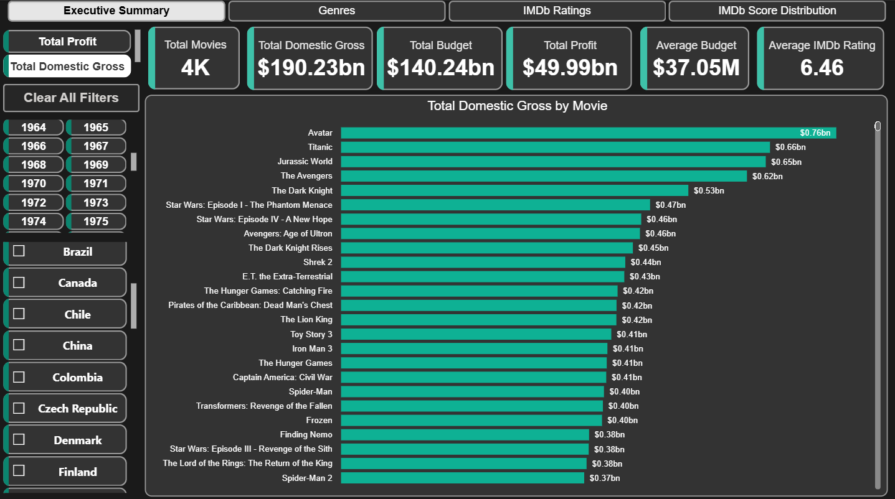
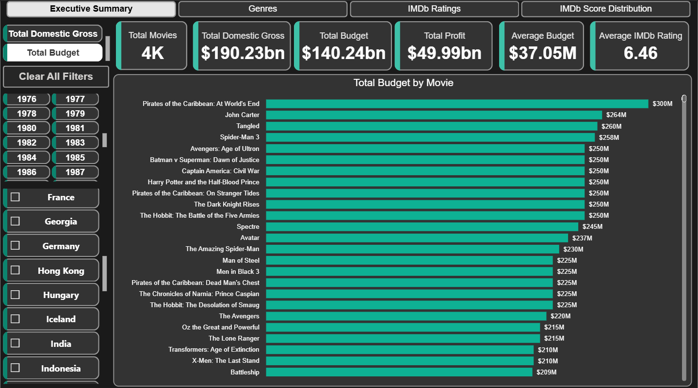
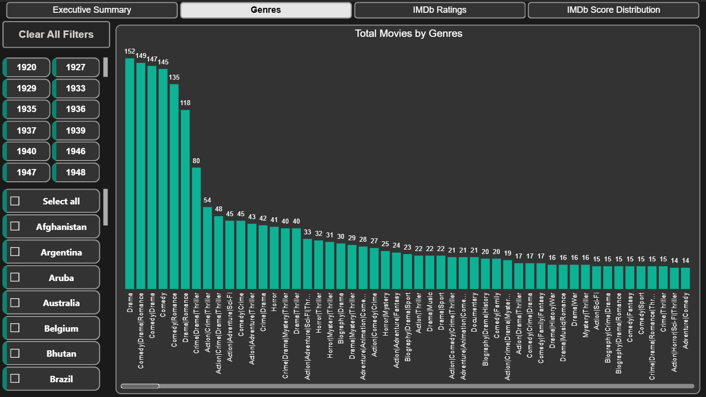
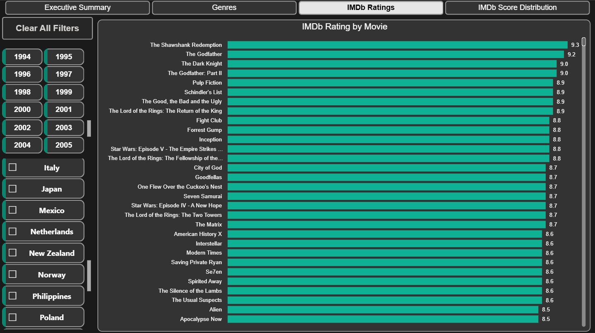
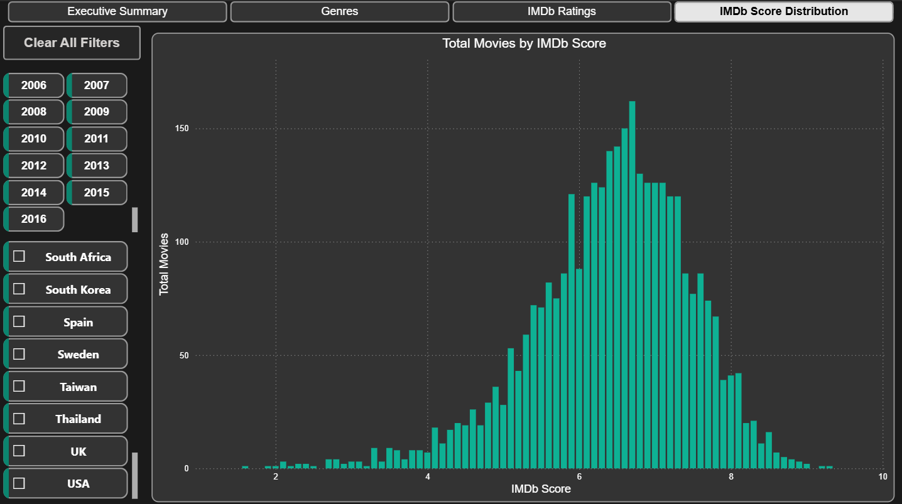

# IMDb Movies Analysis (1920-2016)

## Table of Contents
- [Introduction](#Introduction)
- [Problem Statement](#Problem-Statement)
- [Project Overview](#Project-Overview)
- [Dataset](#Dataset)
- [Data Cleaning and Preparation](#Data-Cleaning-and-Preparation)
- [Data Model](#Data-Model)
- [Analysis and Visualizations](#Analysis-and-Visualizations)
- [Results](#Results)
- [Tools and Technologies](#Tools-and-Technologies)
- [File Structure](#File-Structure)
- [Getting Started](#Getting-Started)


## Introduction
This project analyzes a IMDb movies dataset (1920-2016) to uncover insights into movie performance, ratings, and profitability.  
The workflow integrates **Microsoft Excel** for data cleaning, **PostgreSQL** for analytical queries, and **Power BI Desktop** for interactive visualizations.




## Problem Statement
The IMDb dataset contains raw, inconsistent, and redundant information that makes direct analysis difficult.  
The challenge is to:
- Clean and standardize the dataset.
- Derive meaningful insights on profitability, ratings, and trends.
- Present findings in an interactive, executive‑friendly dashboard.


## Project Overview
The project follows a **three‑stage pipeline**:
1. **Data Cleaning and Preparation** in Excel.
2. **Data Analysis** using PostgreSQL queries.
3. **Visualization and Reporting** in Power BI.


## Dataset
- **Source:** IMDb movies dataset from 1920 to 2016 (CSV format).
- **Records:** 3,853 movies before cleaning; 3,785 after removing duplicates.
- **Key Fields:** `movie_title`, `genre`, `release_year`, `country`, `budget`, `domestic_gross`, `imdb_score`, `num_voted_users`, etc.


## Data Cleaning and Preparation
Performed in **Microsoft Excel (2021)**:
- Removed unnecessary columns (e.g., Facebook likes columns, first actor name and more).
- Removed duplicate movie titles.
- Corrected inconsistent `language` and `country` entries.
- Standardized `budget` to USD.
- Verified and corrected `gross` values.

    

Final dataset exported for PostgreSQL ingestion and Power BI report creation.


## Data Model
- **Single fact table:** `movies_analysis`
- **Key Measures:** Profit (`domestic_gross - budget`), Profit Margin, Average IMDb Score, Total Movies.


## Analysis and Visualizations

### **PostgreSQL Queries**:-
- Highest Profit Movies – Calculated profit as domestic_gross - budget and ranked movies in descending order to identify top earners.
- IMDb Score Buckets (Top 250) – Selected the top 250 movies with more than 25,000 votes, then grouped their IMDb scores into 0.5‑point ranges using WIDTH_BUCKET to find the most common rating intervals. 


### **Power BI Report**:-

The Power BI report contains **4 pages**:

- ### Page 1 – Executive Summary
    KPI cards at the top summarize Total Movies, Total Domestic Gross, Total Budget, Total Profit, Average Budget, and Average IMDb Rating for context. Field parameter slicers allow switching between views of **Total Profit**, **Domestic Gross**, and **Budget** by movie, instantly revealing different leaders in each category.
    Year and Country slicers on the left allow filtering the profit ranking by year and country.

    
    
    - This view of the Executive Summary focuses on profitability, ranking movies by the absolute profit they generated. It’s designed to quickly highlight the most financially successful titles in the dataset.
    - Displays Total Profit (Domestic Gross – Budget) for each movie, sorted in descending order.

    

    - This variation of the Executive Summary ranks movies by their total domestic gross revenue, providing insight into box office performance without factoring in production costs.
    - Bar chart lists the top‑grossing movies in domestic markets, with exact revenue values displayed for each.

    

    - This view highlights the movies with the largest production budgets, offering a perspective on the scale of investment in different films.
    - Bar chart ranks movies by total budget, showing which productions had the highest financial backing.

- ### Page - 2 Genres

    

    This page provides a detailed breakdown of the dataset by movie genre, helping identify dominant categories and niche segments in the film industry.
    - The column chart “Total Movies by Genres” ranks genres by the number of movies, sorted from most to least common.
    - Drama, Comedy, and Romance emerge as the top three genres, indicating their prevalence in the dataset.
    - Year and Country slicers allow filtering to see how genre popularity changes over time or across regions.

- ### Page 3 – IMDb Ratings

    

    This page focuses on the highest-rated movies in the dataset, offering a quick view of standout titles based on IMDb scores.
    - The bar chart “IMDb Rating by Movie” lists movies in descending order of rating, with exact scores displayed.
    - The Shawshank Redemption leads with a score of 9.3, followed by other critically acclaimed titles such as The Godfather and The Dark Knight.
    - Filters for Year and Country enable targeted exploration of top-rated films within specific timeframes and regions.


- ### Page 4 – IMDb Score Bucket

    

    Histogram “Total Movies by IMDb Score” shows most movies cluster between scores of 6.0 and 8.0, with a peak around 7.0.
    - The distribution highlights that extreme low or high scores are relatively rare.
    - Year and Country slicers allow users to analyze how score distributions vary across time periods and geographies.


## Results

The analysis journey began with a raw IMDb dataset that was inconsistent, cluttered, and difficult to interpret.  
Through systematic cleaning in **Excel**, structured querying in **PostgreSQL**, and dynamic visualization in **Power BI**, the data was transformed into a clear story of the movie industry’s financial and critical landscape.

From the **PostgreSQL queries**, two key insights emerged:

- **Profitability Leaders** – Calculating `domestic_gross - budget` revealed *Avatar*, *Jurassic World*, *Titanic* and *Star Wars: The Force Awakens* as the most profitable titles in the dataset.  
- **IMDb Score Patterns** – Grouping the Top 250 movies (with more than 25,000 votes) into 0.5‑point score buckets showed a strong concentration in the **8.0–8.5** range, underscoring the rarity of both extremely high and low ratings among popular films.

The **Power BI report** brought these findings to life across four interactive pages:

1. **Executive Summary** – High‑level KPIs showed a total domestic gross of **$190.23bn**, total budget of **$140.24bn**, and total profit of **$49.99bn** across 4,000 movies.  

2. **Genres** – *Drama* and *Comedy* dominated the dataset, together accounting for a significant share of all films.

3. **IMDb Ratings** – *The Shawshank Redemption* (9.3), *The Godfather* (9.2), and *The Dark Knight* (9.0) topped the ratings chart.

4. **IMDb Score Distribution** – A histogram confirmed that most movies cluster between scores of **6.0 and 8.0**, with a pronounced peak around **7.0**, reflecting the industry’s tendency toward mid‑to‑high ratings.

**Together, these results paint a clear picture:**  
The movie industry’s biggest financial successes are not always its highest‑rated films, popular genres dominate production volume, and audience ratings tend to gravitate toward a narrow quality band.  
The combination of **SQL‑driven analysis** and **interactive Power BI visuals** ensures these insights are both **data‑driven** and **accessible** to decision‑makers.


## Tools and Technologies
- Microsoft Excel (2021)
- PostgreSQL
- Power BI Desktop
- Microsoft Copilot


## File Structure

```
├── data/
│   ├── cleaned_movies.csv               
│   ├── cleaned_movies.xlsx   
│   ├── Movies (1).csv   
├── images/
│   ├── issues/
│   │   └── issues_log.png
│   ├── report/
│   │   ├── executive_summary_profit.png
│   │   ├── executive_summary_domestic_gross.png
│   │   ├── executive_summary_budget.png
│   │   ├── genres.png
│   │   ├── imdb_ratings.png
│   │   └── imdb_score_distribution.png
│   └── report_pages.png  
├── sql/
│   └── table.sql
│   └── movies_analysis.sql
├── report/
│   └── report.pbix
└── README.md
```

## Getting Started

1. Clone or download this repository.
2. Place cleaned_movies.csv in the project root.
3. Import the cleaned dataset into PostgreSQL.
4. Execute queries from sql/analysis_queries.sql to generate insights.
5. Open report.pbix in Power BI Desktop (v2.78+).
6. In Power BI Desktop, go to Transform data → Data source settings, and point the data source to data/cleaned_movies.csv.
7. Click Refresh to load and apply all preconfigured Power Query transforms.
8. Explore the report.